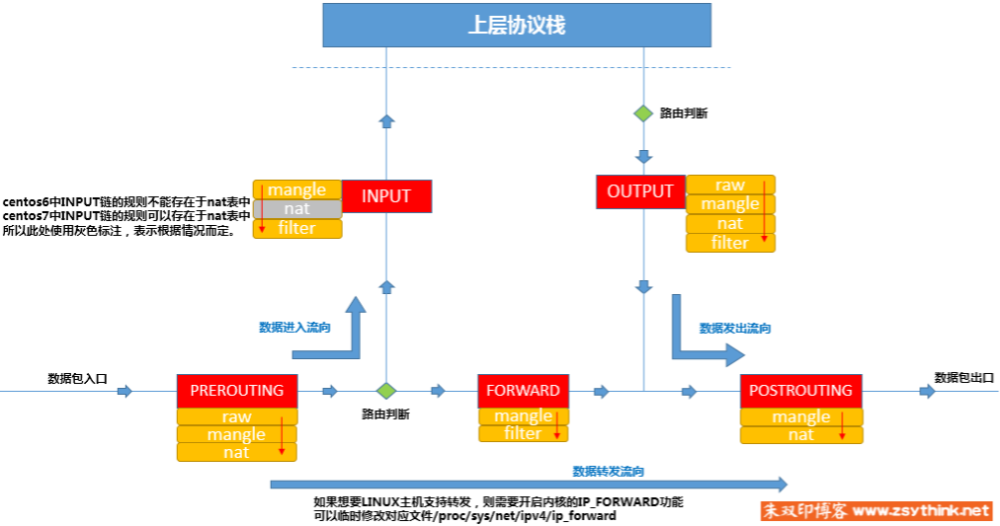

# raspberryPiHotspot
Raspberry Pi 4 Install Raspbian and Launch Hotspot / 树莓派4设置以及创建热点

# Easier alternative way
> [https://github.com/billz/raspap-webgui]

## Useful commands:
```bash
# print architecture
uname -m
dpkg --print-architecture
sudo shutdown -h now
sudo reboot
exit
ping raspberrypi.local
# ping ipv4
ping raspberrypi.local -4
ssh pi@raspberrypi.local
# ssh ipv4 [https://michele.blog/force-ssh-over-ipv4-or-ipv6/]
ssh -4 pi@raspberrypi.local
# ssh to ipv6
ssh pi@fe80::a957:4002:81fa:2c4c%18
# Switch to root privileges
sudo -i
# system log
tail -100f /var/log/syslog
sudo iptables -L
# check linux version
cat /etc/os-release
ping -S 192.168.0.1 google.com
# find out the default gateway
ip route show
ip route show | grep default
# find IP packet trace
Windows:
tracert -4
Linux:
traceroute -4
```

## set up hostname and connect to wifi(it takes long time for new hostname to work)  
> instead, just ping raspberrypi/raspberrypi.local for a few times. It would sometimes let you ssh via a weird IP 
sometimes the pi is assigned wrong ip address, cannot ssh with hostname, nmap, ping  
```
ssh to pi, open the file(cannot edit sd card directly, permission denied)
/rootfs/etc/dhcpcd.conf
sudo nano /etc/dhcpcd.conf

Append eth0 for pi4, usb0 for pi zero
interface eth0
static ip_address=192.168.0.4/24
static routers=192.168.0.1
static domain_name_servers=192.168.0.1

If you have multiple pi, change hostname(doesn't work)
terminal:
hostname pi0a
hostname pi0b
hostname pi4a
hostname pi4b

change hostname with:
sudo raspi-config

sudo reboot

windows get ip from hostanme
nslookup pi0a
```

## install ssh
```
sudo apt-get install openssh-server
sudo service ssh status
hostname -I
ssh -p 2022 mw@127.0.0.1
```

## pi default username and password
```
pi
raspberry
```

## Remote control pi from windows [http://larsonm.com/index.php/2013/remotely-reboot-your-raspberry-pi-from-a-windows-desktop-shortcut-using-plink-putty/]
```
install putty on windows, then you would have plink
plink -ssh user@server -pw password reboot
plink -ssh pi@192.168.0.10 -pw password reboot
plink -ssh pi@192.168.0.10 -pw password "sudo shutdown -h now"
```

## vnc change resolution[https://shumeipai.nxez.com/2019/07/08/set-the-resolution-of-the-raspberry-pi-vnc.html]  
sudo raspi-config -> advanced option -> resolution -> 1280 * 720  

## print ip table
```
Windows:
route print -4
```

## interface vs. gateway
```
In this example, the address in the interface column is used to identify the particular interface (your computer may have more than one). Since naming conventions often depend on hardware, it is easier to identify them by IP address.

For example, your routing table shows the default gateway is 192.168.0.1, and it can be reached by using the interface that has the IP address 192.168.0.100.

IP routing tables assume the device has multiple network interfaces, although most PCs have only one. When there is more than one, the device needs to know which interface to use to reach the gateway. The interface column defines that. In the context of home networking, only your router has more than one interface.
```

## arp binding  
Sometime your network may not be safe. Host and guest cannot arp bind at the same time.
```
Linux:
arp
sudo arp -s 10.0.0.1 b0:39:56:d3:08:2d
Windows CMD admin:
netsh interface ipv4 add neighbors "Wi-Fi 2" 10.0.0.1 b0-39-56-d3-08-2d
netsh interface ip delete neighbors "Network card name here" "Gateway.IP.goes.here"
```

## error “Internet Connection Sharing is currently enable for connection” when sharing my Wifi to ethernet  
> https://www.thewindowsclub.com/an-error-occurred-while-internet-connection-sharing-was-being-enabled  
```
windows open services
restart Internet Connection Sharing (ICS) service
```

## Notes:
* Pi 4 won't boot without HDMI plugged in
> Adding hdmi_force_hotplug=1 to /boot/config.txt seems to have solved the problem. [https://www.raspberrypi.org/forums/viewtopic.php?t=253312]

* nmap, raspberrypi.local tutorial[https://www.raspberrypi.org/documentation/remote-access/ip-address.md] 
> windows[https://nmap.org/download.html] 
> nmap cheatsheet[https://hackertarget.com/nmap-cheatsheet-a-quick-reference-guide/]  
```
nmap -sn 192.168.1.0/24
# find domain name server
cat /etc/resolv.conf
```

* Resolve "Host key verification failed"
> Delete raspberrypi.local column in known_hosts file if you are using windows  
> For example, C:\Users\ybob\.ssh\known_hosts

* HDMI port
> Raspberry Pi 4 uses Micro HDMI  
> Raspberry Pi Zero uses Mini HDMI

* X-forwarding(not working, use vnc instead)  
> [https://www.raspberrypi.org/documentation/remote-access/ssh/unix.md] 
> [http://raspberrypiprogramming.blogspot.com/2014/07/how-to-execute-x11-applications-from.html]  
`ssh -Y pi@192.168.4.1`

* When PC reboots, pi may lose network
> disable Wifi card, ethernet card, Wifi card sharing. Then reopen.

## Steps:
1. Download Raspbian[https://www.raspberrypi.org/downloads/raspbian/]  
We choose "Raspbian Buster with desktop and recommended software"

2. Flash Raspbian system to SD card with balenaetcher[https://www.balena.io/etcher/]

3. Use ethernet cable to connect your PC ethernet port to Raspberry Pi ethernet port  
  Looks like this:
    >PC - PC ethernet port - Raspberry Pi ethernet port - Raspberry Pi

    PC ethernet port configuration:  
    >IP address: 192.168.0.1  
    >Subnet mask: 255.255.255.0
    
    If your PC is using Wifi, right click -> properites -> sharing -> allow other users -> Home networking connection(Ethernet, the one connects with pi). Now, your pi would have the network. 

4. Boot Raspberry Pi, enable SSH, VNC [https://www.raspberrypi.org/documentation/remote-access/ssh/]  
Open terminal, type 
```
  ifconfig
```

    or

```
  ip a
```

    From eth0 row, write down your pi IP address. My pi shows 192.168.0.151

5. Switch back to your PC, ping pi_ip_address to verify if your connection works
```
  ping pi_ip_address
```

    or

```
  ping raspberrypi.local
```

6. From PC, SSH to your pi
```
  ssh pi@pi_ip_address
```

    or

```
  ssh pi@raspberrypi.local
```

7. Set up static IP[https://www.ionos.com/digitalguide/server/configuration/provide-raspberry-pi-with-a-static-ip-address/] 
```
sudo nano /etc/dhcpcd.conf
```
append
```
interface eth0
static ip_address=192.168.0.10/24
static routers=192.168.0.1
static domain_name_servers=192.168.0.1
```
then
```
sudo reboot
```
verify by
```
ping raspberrypi.local -4
```

8. Install Chinese Input (optional)
```
// Install Google Pinyin input method
sudo apt-get install fcitx fcitx-googlepinyin fcitx-module-cloudpinyin fcitx-sunpinyin
// Restart the Raspberry Pi
reboot
// Use shift to change input method
```

9. Launch Hotspot 
[https://www.raspberrypi.org/documentation/configuration/wireless/access-point-routed.md] 
[https://www.raspberrypi.org/documentation/configuration/wireless/access-point.md] 
[https://thepi.io/how-to-use-your-raspberry-pi-as-a-wireless-access-point/] 
[https://elinux.org/RPI-Wireless-Hotspot] 
[https://www.thegeekpub.com/240065/setup-a-raspberry-pi-wireless-access-point/] 

```
# dnsmasq -> DHCP service, hostapd -> launch wifi
sudo apt install dnsmasq hostapd
# turn off first
sudo systemctl stop dnsmasq
sudo systemctl stop hostapd

# configure static IP
sudo nano /etc/dhcpcd.conf
# append at the end
interface wlan0
    static ip_address=192.168.4.1/24
    nohook wpa_supplicant
# restart dhcpcd
sudo service dhcpcd restart
# configure DHCP service
sudo mv /etc/dnsmasq.conf /etc/dnsmasq.conf.orig
sudo nano /etc/dnsmasq.conf
# append
interface=wlan0      # Use the require wireless interface - usually wlan0
dhcp-range=192.168.4.2,192.168.4.20,255.255.255.0,24h
# start dnsmasq
sudo systemctl start dnsmasq

# configure hostapd
sudo nano /etc/hostapd/hostapd.conf
# copy & paste, fill in the password
# pi 4 uses the same driver number as pi 3. hw_mode=g is the best choice here
interface=wlan0
driver=nl80211
ssid=ChiTown2
hw_mode=g
channel=7
wmm_enabled=0
macaddr_acl=0
auth_algs=1
ignore_broadcast_ssid=0
wpa=2
wpa_passphrase=password
wpa_key_mgmt=WPA-PSK
wpa_pairwise=TKIP
rsn_pairwise=CCMP
# open
sudo nano /etc/default/hostapd
# Find the line with #DAEMON_CONF, and replace it with this:
DAEMON_CONF="/etc/hostapd/hostapd.conf"

# start up
sudo systemctl unmask hostapd
sudo systemctl enable hostapd
sudo systemctl start hostapd
# check status
sudo systemctl status hostapd
sudo systemctl status dnsmasq

# Add routing and masquerade
# Edit /etc/sysctl.conf and uncomment this line:

net.ipv4.ip_forward=1
# Add a masquerade for outbound traffic on eth0:

sudo iptables -t nat -A  POSTROUTING -o eth0 -j MASQUERADE

or[https://learn.sparkfun.com/tutorials/setting-up-a-raspberry-pi-3-as-an-access-point/all]:
sudo iptables -t nat -A POSTROUTING -o eth0 -j MASQUERADE  
sudo iptables -A FORWARD -i eth0 -o wlan0 -m state --state RELATED,ESTABLISHED -j ACCEPT
sudo iptables -A FORWARD -i wlan0 -o eth0 -j ACCEPT

# Save the iptables rule.

sudo sh -c "iptables-save > /etc/iptables.ipv4.nat"
Edit /etc/rc.local and add this just above "exit 0" to install these rules on boot.

iptables-restore < /etc/iptables.ipv4.nat

# Reboot and ensure it still functions.
``` 
[http://www.zsythink.net/archives/1199] 
 


To be continued...

## ssh into pi zero only with USB[https://desertbot.io/blog/ssh-into-pi-zero-over-usb]
```
1. enable ssh
touch /boot/ssh
2. open config.txt, Append this line to the bottom
dtoverlay=dwc2
3. Edit cmdline.txt, After rootwait, append this text leaving only one space between rootwait and the new text (otherwise it might not be parsed correctly):
modules-load=dwc2,g_ether
4. use data port to boot pi
5. ssh
ssh -4 pi@raspberrypi.local
6. open ssh, vnc[https://www.raspberrypi.org/documentation/remote-access/vnc/]
sudo raspi-config
7. check memory, CPU usage
top
```

## Additonal Notes: 
bridge etho and wifi0[https://www.pcgamer.com/how-to-build-a-raspberry-pi-wireless-access-point/] 
```
First:

'auto br0'

To bring the interface up at boot time.

'iface br0 inet manual'

To tell the bridge that we want the router’s DHCP service to deal with assigning it an IP address. Finally:

'bridge_ports eth0 wlan0' 

To tell the bridge precisely what you want it to do—that is, sit between the Ethernet and Wi-Fi devices, and bridge all network ports between them.
```
```
配置Pycharm环境变量：
假设你把pycharm安装到/home/pi/pycharm-community-2019.1.3
那么在~/.profile里加一句话
export PATH=$PATH:~/pycharm-community-2019.1.3/bin
保存，然后打开一个新命令行
输入：
pycharm.sh
程序就会启动啦。当命令行关闭时，pycharm会被强制关掉
注：~/.bash_rc似乎没法使用，不知道为啥
```
Adding A 2nd Fixed IP Address To The Ethernet Port
```
For example, say you want the RPi Ethernet port to use DHCP, but to also have a fixed IP address so you can connect to it using a direct cable connection from a laptop.


sudo nano /etc/network/interfaces
Use this for the eth0 adaptor:


auto eth0
allow-hotplug eth0
iface eth0 inet dhcp

auto eth0:1
iface eth0:1 inet static
       address 192.168.1.123
       netmask 255.255.255.0
```
route ip packet from wifi to ethernet [https://www.raspberrypi.org/forums/viewtopic.php?t=223295]
```
Install dnsmasq.
Code: Select all

sudo apt-get install dnsmasq
Assign eth0 an IP address. Open /etc/dhcpcd.conf with a text editor and add this at the bottom.
Code: Select all

interface eth0
static ip_address=192.168.4.1/24
Save original dnsmasq.conf
Code: Select all

sudo mv /etc/dnsmasq.conf /etc/dnsmasq.conf.orig
Open /etc/dnsmasq.conf with a text editor and add this
Code: Select all

interface=eth0
dhcp-range=192.168.4.8,192.168.4.250,255.255.255.0,12h
Edit /etc/sysctl.conf and uncomment
Code: Select all

net.ipv4.ip_forward=1
Open /etc/rc.local with a text editor and add this just above "exit 0"
Code: Select all

iptables -t nat -A  POSTROUTING -o wlan0 -j MASQUERADE
Reboot.

If you have problems with the dhcp service, you can check the status of dnsmasq.conf.
Code: Select all

sudo service dnsmasq status
It should show active (running), and a list of IP assignments to each mac address..
```
sh vc. bash 
> [https://stackoverflow.com/questions/5725296/difference-between-sh-and-bash]  
```
The complication is that /bin/sh could be a symbolic link or a hard link. If it's a symbolic link, a portable way to resolve it is:

% file -h /bin/sh
/bin/sh: symbolic link to bash
If it's a hard link, try

% find -L /bin -samefile /bin/sh
/bin/sh
/bin/bash
```
